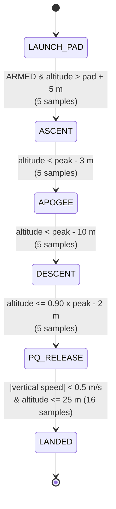

# Flight Software State Flow and Transition Conditions

Container flight software state machine for the CanSat 2027 mission.
This document describes every state, the exact condition that leaves it, and the
filtering / debouncing used so that transitions are not triggered by sensor noise
or faults.

Source of truth: `fsw_logic.c`.

---

## 1. Scope

The container carries a PocketQube and is responsible for:

1. Detecting launch and tracking altitude from the **barometric pressure sensor**.
2. Detecting apogee.
3. Releasing the PocketQube at **90% of peak altitude** (Requirement C3).
4. Reducing telemetry from 4 Hz to 1 Hz five seconds after release (CTR16).
5. Stopping telemetry after landing.
6. Logging telemetry continuously to CSV.

The state machine is **barometric-only** for the container: the container has no
inertial measurement unit (only pressure, temperature, and battery sensors are
required, CTR18-CTR22).

---

## 2. State Model

Six internal states are used. Four of them are the official telemetry states
(Requirement CTR14); `DESCENT` and `LANDED` are internal refinements that are
mapped to the nearest official state on the telemetry link.



ASCII equivalent:

```
            ARM + climb
 LAUNCH_PAD ------------> ASCENT
                              |  drop > 3 m below peak
                              v
                           APOGEE
                              |  drop > 10 m below peak
                              v
                           DESCENT
                              |  alt <= 0.90 * peak - 2 m
                              v
                         PQ_RELEASE  --(5 s)--> telemetry 1 Hz
                              |  |v| < 0.5 m/s and alt <= 25 m
                              v
                           LANDED  --------> telemetry off
```

### 2.1 State definitions

| Internal state | Telemetry `STATE` | Meaning |
|---|---|---|
| `LAUNCH_PAD` | `LAUNCH_PAD` | On the pad, waiting for `ARM` and launch. |
| `ASCENT` | `ASCENT` | Powered ascent detected; peak altitude is being tracked. |
| `APOGEE` | `APOGEE` | Peak altitude detected; now descending. |
| `DESCENT` | `APOGEE` | Confirmed descent, above the release altitude. |
| `PQ_RELEASE` | `PQ_RELEASE` | PocketQube released; waiting for landing. |
| `LANDED` | `PQ_RELEASE` | Vehicle stopped; mission complete, telemetry off. |

`STATE_LAUNCH_PAD` is the value 0, and each later state increments by one, so
the numeric state can be stored in NVM as a single byte and compared with `>`.

---

## 3. Transition Conditions

All transitions require a **persistent** condition (debounce) so a single noisy
sample cannot change state. `++counter > N` means the transition fires after
`N + 1` consecutive qualifying samples.

| # | From -> To | Guard condition | Debounce | Time @ 10 Hz |
|---|---|---|---|---|
| 1 | `LAUNCH_PAD -> ASCENT` | `armed == true` AND `alt > ASCENT_MARGIN_M` (+5 m) | `ascent_count > 4` | ~0.5 s |
| 2 | `ASCENT -> APOGEE` | `alt < peak - APOGEE_DROP_M` (-3 m) | `apogee_count > 4` | ~0.5 s |
| 3 | `APOGEE -> DESCENT` | `alt < peak - DESCENT_DROP_M` (-10 m) | `descent_count > 4` | ~0.5 s |
| 4 | `DESCENT -> PQ_RELEASE` | `alt <= 0.90 * peak - RELEASE_HYST_M` | `release_count > 4` | ~0.5 s |
| 5 | `PQ_RELEASE -> LANDED` | `abs(vertical_speed) < 0.5 m/s` AND `alt <= 25 m` | `landed_count > 15` | ~1.6 s |

If the guard is not satisfied on any sample, the corresponding counter resets to
zero, restarting the debounce window.

### 3.1 Transition 1 - Launch detection

- Requires the **ARM** command. Without it the machine stays on the pad, so
  being carried or jostled during integration cannot start the mission.
- `ASCENT_MARGIN_M = 5 m` is roughly ten times the barometric noise amplitude
  (~0.5 m), so only a real climb crosses it.
- Cross-checks against the barometric-only limitation: because the container has
  no accelerometer, launch is confirmed by a sustained altitude rise rather than
  by measured acceleration.

### 3.2 Transition 2 - Apogee detection

- The peak is latched continuously (`maximum_height_m`); apogee is declared only
  after altitude falls 3 m below that latched peak for 5 consecutive samples.
- This makes apogee detection robust to a momentary pressure spike that would
  otherwise look like a negative or positive peak.
- The **latched peak is the reference for the release altitude**, not the
  altitude at the moment the `APOGEE` label appears.

### 3.3 Transition 3 - Descent confirmation

- A second, larger hysteresis (`10 m`) confirms a sustained fall after apogee
  and keeps the machine from bouncing between `APOGEE` and `DESCENT`.

### 3.4 Transition 4 - PocketQube release (Requirement C3)

- Release altitude = `RELEASE_FRACTION (0.90) * peak altitude`.
- An additional `RELEASE_HYST_M = 2 m` is subtracted: the release fires at
  `0.90 * peak - 2 m`, so noise cannot chatter the release command around the
  exact threshold.
- The release is latched as a one-shot command (`FswTakeReleaseCommand`), so it
  is actuated exactly once even if the state is processed many times.
- Five seconds after release the telemetry rate drops to 1 Hz (CTR16), handled
  by the telemetry layer using the time of the release event.

### 3.5 Transition 5 - Landing detection

- Landing uses **filtered vertical speed**, not an instantaneous altitude
  difference. A per-sample difference test is broken by noise: with a +/-0.45 m
  jitter, a 0.5 m threshold is repeatedly crossed and the debounce never
  completes.
- The vertical speed is low-pass filtered (`VSPEED_FILTER_ALPHA = 0.2`), and
  landing requires `|v| < 0.5 m/s` **and** altitude within 25 m of the pad for
  16 consecutive samples (~1.6 s).
- On landing the machine sets `active = false`, which stops `FswUpdate` and the
  telemetry loop.

---

## 4. Sensor Noise and Fault Handling

| Hazard | Mitigation |
|---|---|
| Barometric random noise | 5-sample moving average plus transition debouncing and hysteresis bands. |
| Single-sample pressure spike | Slew-rate rejection (`MAX_ALT_RATE_MPS = 250 m/s`): an implausible jump holds the previous altitude. |
| Pad pressure drift / absolute offset | 20-sample pad calibration; all logic uses **relative** (AGL) altitude. |
| Movement before launch | `ARM` gate on ascent detection. |
| False apogee from a spike | Peak latched continuously; apogee needs a sustained 3 m drop. |
| Release chatter at threshold | 2 m hysteresis below the 90% line and a one-shot release command. |
| Landing false positive | Speed-based detection with a 1.6 s persistence window. |
| Non-finite / invalid reading | `isfinite` check; invalid samples are ignored. |
| Processor reset | Pad pressure, state, peak, and times are persisted in NVM (Section 6). |

Processed altitude pipeline:

```
pressure (or SIM pressure)
  -> pressure_to_altitude_m  (barometric formula)
  -> relative_altitude_m     (subtract pad reference)
  -> slew-rate rejection     (MAX_ALT_RATE_MPS)
  -> 5-sample moving average
  -> vertical speed low-pass
  -> state machine
```

---

## 5. Simulation Mode

Purpose (Requirements F4, F5, F6, GS7, GS16): demonstrate the full mission when a
launch is not possible, using a pressure profile from the Ground Station.

- `FswEnableSimulation(true)` arms simulation mode only after the two commands
  `SIM ENABLE` and `SIM ACTIVATE` have both been received.
- `FswSetSimulatedPressure(p)` supplies one value per second via `SIMP`.
- `FswUpdate` substitutes the simulated pressure for the real sensor while
  simulation mode is active; every other sensor remains real (battery,
  temperature).
- The state logic itself is identical in flight and simulation; only the pressure
  source changes.

```
FLIGHT:      real pressure  --\
                                >-- FswUpdate -> state machine -> telemetry
SIMULATION:  SIMP pressure  --/
```

---

## 6. Reset and Persistence (Requirements F2, F8)

`FswSaveToNvm` / `FswLoadFromNvm` preserve across a processor reset:

| Field | Why |
|---|---|
| `state` | Mission does not restart from `LAUNCH_PAD`. |
| `pad_pressure_pa` | Zero-altitude calibration survives (F8). |
| `maximum_height_m` | Peak / apogee is not lost. |
| `mission_time_s` | Mission time continues across resets (F2). |
| `apogee_time_s` | Apogee time is preserved. |
| `apogee_pressure_pa` | Apogee pressure value is preserved. |

On restore, if the recovered state is at or beyond `ASCENT`, the vehicle is
treated as `armed` so a subsequent reset cannot re-lock the machine on the pad.

---

## 7. Apogee Logging and the True Peak

The `STATE = APOGEE` label is intentionally **late** (3 m after the true peak),
so it must never be used as the apogee value. Instead:

- The peak (`maximum_height_m`) and its time (`apogee_time_s`) are latched on
  every update cycle, at full loop rate.
- They are logged in dedicated CSV columns `APOGEE_ALT` and `APOGEE_TIME`, so
  every row carries the running best estimate.
- After the flight, `max(APOGEE_ALT)` over the file is the true apogee.
- The same latched peak drives the 90% release, so release altitude and logged
  apogee stay consistent.
- For maximum accuracy, post-process the high-rate log with a parabolic vertex
  fit around the peak (`h = A t^2 + B t + C`, peak at `t* = -B / 2A`).

Example (`Flight_1000C.csv`):

```
MISSION_TIME  ALTITUDE  STATE     APOGEE_ALT  APOGEE_TIME
18.000        662.6     APOGEE    670.9       16.100
```

The labeled row reads 662.6 m; the true peak is 670.9 m at t = 16.1 s.

---

## 8. Timing Assumptions

| Parameter | Value |
|---|---|
| FSW update rate (reference) | 10 Hz, `dt = 0.1 s` |
| Container telemetry rate (pre-release) | 4 Hz (CTR15) |
| Container telemetry rate (post-release) | 1 Hz, 5 s after release (CTR16) |
| Descent rate (container) | 10 m/s +/- 3 m/s (C2, CTR5) |
| Estimated flight duration | ~90 s to landing from 670 m |

The debounce counts are expressed in samples and assume the 10 Hz update rate. If
the update rate changes, scale the counters or convert them to millisecond
timers. The CSV formatter `FswFormatCsvRow` is called by the telemetry scheduler,
not by the state machine, so logging rate and control rate are independent.

---

## 9. Constants Reference

| Constant | Value | Role |
|---|---|---|
| `ALT_FILTER_SIZE` | 5 | Moving-average window. |
| `PAD_CAL_SAMPLES` | 20 | Samples averaged for pad reference. |
| `ASCENT_CONFIRM` | 4 | Ascent debounce. |
| `APOGEE_CONFIRM` | 4 | Apogee debounce. |
| `DESCENT_CONFIRM` | 4 | Descent debounce. |
| `RELEASE_CONFIRM` | 4 | Release debounce. |
| `LANDED_CONFIRM` | 15 | Landing debounce. |
| `ASCENT_MARGIN_M` | 5.0 m | Rise above pad to call ascent. |
| `APOGEE_DROP_M` | 3.0 m | Drop below peak to call apogee. |
| `DESCENT_DROP_M` | 10.0 m | Drop below peak to confirm descent. |
| `RELEASE_FRACTION` | 0.90 | Fraction of peak for release (C3). |
| `RELEASE_HYST_M` | 2.0 m | Release hysteresis. |
| `LANDED_SPEED_MPS` | 0.5 m/s | Speed threshold for landing. |
| `LANDED_MAX_ALT_M` | 25.0 m | Max altitude for landing. |
| `VSPEED_FILTER_ALPHA` | 0.2 | Vertical-speed low-pass coefficient. |
| `MAX_ALT_RATE_MPS` | 250 m/s | Slew-rate / outlier limit. |

---

## 10. API Summary

| Function | Purpose |
|---|---|
| `FswInit` | Initialise the state machine. |
| `FswStartPadCalibration` / `FswFeedPadCalibration` | Collect and set the pad pressure. |
| `FswSetArmed` | Arm launch detection (`ARM` command). |
| `FswEnableSimulation` / `FswSetSimulatedPressure` | Simulation mode (`SIM`, `SIMP`). |
| `FswUpdate` | Run one control step. |
| `FswTakeReleaseCommand` | Consume the one-shot release command. |
| `FswPeakAltitude` / `FswPeakTime` / `FswMissionTime` | Access latched peak and times. |
| `FswFormatCsvHeader` / `FswFormatCsvRow` | Format telemetry CSV lines. |
| `FswSaveToNvm` / `FswLoadFromNvm` | Persist / restore across reset. |

---

## 11. Requirements Traceability

| Requirement | Where addressed |
|---|---|
| C2, CTR5 (10 m/s descent) | Not enforced by FSW; reported via `ALTITUDE`. |
| C3 (release at 90% peak) | Transition 4, `RELEASE_FRACTION`. |
| C4, C5 (PQ power-up, 4 Hz) | PocketQube FSW (separate). |
| CTR15 (4 Hz on) | Telemetry scheduler. |
| CTR16 (1 Hz after release) | Release event in telemetry layer + `FswTakeReleaseCommand`. |
| CTR18, CTR19 (pressure, altitude) | `FswUpdate` altitude pipeline. |
| F2, F8 (mission time, calibration survive reset) | `FswSaveToNvm` / `FswLoadFromNvm`. |
| F4, F5, F6 (simulation mode) | `FswEnableSimulation` / `FswSetSimulatedPressure`. |
